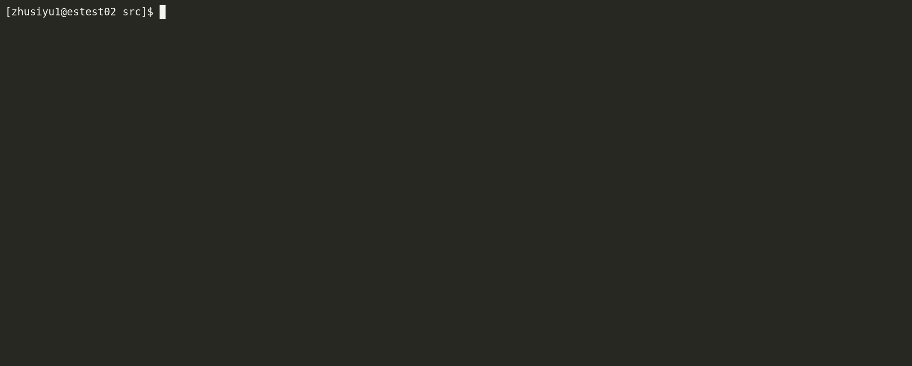
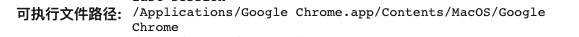
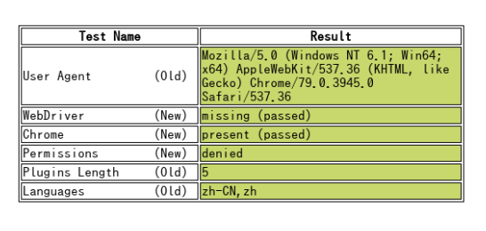

# crawlergo

  [](https://www.blackhat.com/eu-21/arsenal/schedule/index.html#crawlergo-a-powerful-browser-crawler-for-web-vulnerability-scanners-25113)

> A powerful browser crawler for web vulnerability scanners

[English Document](./README.md) | 中文文档

crawlergo是一个使用`chrome headless`模式进行URL收集的浏览器爬虫。它对整个网页的关键位置与DOM渲染阶段进行HOOK，自动进行表单填充并提交，配合智能的JS事件触发，尽可能的收集网站暴露出的入口。内置URL去重模块，过滤掉了大量伪静态URL，对于大型网站仍保持较快的解析与抓取速度，最后得到高质量的请求结果集合。

crawlergo 目前支持以下特性：

* 原生浏览器环境，协程池调度任务
* 表单智能填充、自动化提交
* 完整DOM事件收集，自动化触发
* 智能URL去重，去掉大部分的重复请求
* 全面分析收集，包括javascript文件内容、页面注释、robots.txt文件和常见路径Fuzz
* 支持Host绑定，自动添加Referer
* 支持请求代理，支持爬虫结果主动推送

## 运行截图



## 安装

**安装使用之前，请仔细阅读并确认[免责声明](./Disclaimer.md)。**

**Build**

```shell
cd crawlergo/cmd/crawlergo
go build crawlergo_cmd.go
```

1. crawlergo 只依赖chrome运行即可，前往[下载](https://www.chromium.org/getting-involved/download-chromium)新版本的chromium。
2. 前往[页面下载](https://github.com/0Kee-Team/crawlergo/releases)最新版本的crawlergo解压到任意目录，如果是linux或者macOS系统，请赋予crawlergo**可执行权限(+x)**。
3. 或者直接根据源码自行编译。

> 如果你使用linux系统，运行时chrome提示缺少一些依赖组件，请看下方 Trouble Shooting

## Quick Start

### Go！

假设你的chromium安装在 `/tmp/chromium/` ，开启最大10标签页，爬取AWVS靶场：

```shell
./crawlergo -c /tmp/chromium/chrome -t 10 http://testphp.vulnweb.com/
```


### 使用代理

```shell
./crawlergo -c /tmp/chromium/chrome -t 10 --request-proxy socks5://127.0.0.1:7891 http://testphp.vulnweb.com/
```


### 系统调用

默认打印当前域名请求，但多数情况我们希望调用crawlergo返回的结果，所以设置输出模式为 `json`，使用python调用并收集结果的示例如下：

```python
#!/usr/bin/python3
# coding: utf-8

import simplejson
import subprocess


def main():
    target = "http://testphp.vulnweb.com/"
    cmd = ["./crawlergo", "-c", "/tmp/chromium/chrome", "-o", "json", target]
    rsp = subprocess.Popen(cmd, stdout=subprocess.PIPE, stderr=subprocess.PIPE)
    output, error = rsp.communicate()
	#  "--[Mission Complete]--"  是任务结束的分隔字符串
    result = simplejson.loads(output.decode().split("--[Mission Complete]--")[1])
    req_list = result["req_list"]
    print(req_list[0])


if __name__ == '__main__':
    main()
```

### 返回结果

当设置输出模式为 `json`时，返回的结果反序列化之后包含四个部分：

* `all_req_list`： 本次爬取任务过程中发现的所有请求，包含其他域名的任何资源类型。
* `req_list`：本次爬取任务的**同域名结果**，经过伪静态去重，不包含静态资源链接。理论上是 `all_req_list `的子集
* `all_domain_list`：发现的所有域名列表。
* `sub_domain_list`：发现的任务目标的子域名列表。


## 完整参数说明

crawlergo 拥有灵活的参数配置，以下是详细的选项说明：

* `--chromium-path Path, -c Path`    chrome的可执行程序路径
* `--custom-headers Headers`   自定义HTTP头，使用传入json序列化之后的数据，这个是全局定义，将被用于所有请求
* `--post-data PostData, -d PostData`   提供POST数据，目标使用POST请求方法
* `--max-crawled-count Number, -m Number`   爬虫最大任务数量，避免因伪静态造成长时间无意义抓取。
* `--filter-mode Mode, -f Mode`   过滤模式，简单：只过滤静态资源和完全重复的请求。智能：拥有过滤伪静态的能力。严格：更加严格的伪静态过滤规则。
* `--output-mode value, -o value`   结果输出模式，`console`：打印当前域名结果。`json`：打印所有结果的json序列化字符串，可直接被反序列化解析。`none`：不打印输出。
* `--output-json filepath` 将爬虫结果JSON序列化之后写入到json文件。
* `--incognito-context, -i`   浏览器启动隐身模式
* `--max-tab-count Number, -t Number`   爬虫同时开启最大标签页，即同时爬取的页面数量。
* `--fuzz-path`  使用常见路径Fuzz目标，获取更多入口。
* `--fuzz-path-dict`  通过字典文件自定义Fuzz目录，传入字典文件路径，如：`/home/user/fuzz_dir.txt`，文件每行代表一个要fuzz的目录。
* `--robots-path` 从 /robots.txt 文件中解析路径，获取更多入口。
* `--request-proxy proxyAddress` 支持**socks5**代理，crawlergo和chrome浏览器的所有网络请求均经过代理发送。
* `--tab-run-timeout Timeout`   单个Tab标签页的最大运行超时。
* `--wait-dom-content-loaded-timeout Timeout`  爬虫等待页面加载完毕的最大超时。
* `--event-trigger-interval Interval` 事件自动触发时的间隔时间，一般用于目标网络缓慢，DOM更新冲突时导致的URL漏抓。
* `--event-trigger-mode Value` 事件自动触发的模式，分为异步和同步，用于DOM更新冲突时导致的URL漏抓。
* `--before-exit-delay` 单个tab标签页任务结束时，延迟退出关闭chrome的时间，用于等待部分DOM更新和XHR请求的发起捕获。
* `--ignore-url-keywords` 不想访问的URL关键字，一般用于在携带Cookie访问时排除注销链接。用法：`-iuk logout -iuk exit`。
* `--form-values` 自定义表单填充的值，按照文本类型设置。支持定义类型：default, mail, code, phone, username, password, qq, id_card, url, date, number，文本类型通过输入框标签的`id`、`name`、`class`、`type`四个属性值关键字进行识别。如，定义邮箱输入框自动填充A，密码输入框自动填充B，`-fv mail=A -fv password=B`。其中default代表无法识别文本类型时的默认填充值，目前为Cralwergo。
* `--form-keyword-values` 自定义表单填充的值，按照关键字模糊匹配设置。关键字匹配输入框标签的`id`、`name`、`class`、`type`四个属性值。如，模糊匹配pass关键词填充123456，user关键词填充admin，`-fkv user=admin -fkv pass=123456`。
* `--push-to-proxy` 拟接收爬虫结果的监听地址，一般为被动扫描器的监听地址。
* `--push-pool-max` 发送爬虫结果到监听地址时的最大并发数。
* `--log-level` 打印日志等级，可选 debug, info, warn, error 和 fatal。
* `--no-headless`  关闭chrome headless模式，可直观的看到爬虫过程。


## 使用举例

crawlergo 返回了全量的请求和URL信息，可以有多种使用方法：

* 联动其它的开源被动扫描器

  首先，启动某被动扫描器，设置监听地址为：`http://127.0.0.1:1234/`。

  接下来，假设crawlergo与扫描器在同一台机器，启动 crawlergo，设置参数：

  `--push-to-proxy http://127.0.0.1:1234/`

* 子域名收集  example

* 旁站入口收集  example

* 结合celery实现分布式扫描

* Host绑定设置（高版本chrome无法使用）  [(查看例子)](https://github.com/0Kee-Team/crawlergo/blob/master/examples/host_binding.py)

* 带Cookie扫描  [(查看例子)](https://github.com/0Kee-Team/crawlergo/blob/master/examples/request_with_cookie.py)

* 调用crawlergo调用产生僵尸进程，定时清理 [(查看例子)](https://github.com/0Kee-Team/crawlergo/blob/master/examples/zombie_clean.py) , contributed by @ring04h

## Trouble Shooting

* 'Fetch.enable' wasn't found

  Fetch是新版chrome支持的功能，如果出现此错误，说明你的版本较低，请升级chrome到最新版即可。
  
* chrome运行提示缺少 xxx.so 等依赖

  ```shell
  // Ubuntu
  apt-get install -yq --no-install-recommends \
       libasound2 libatk1.0-0 libc6 libcairo2 libcups2 libdbus-1-3 \
       libexpat1 libfontconfig1 libgcc1 libgconf-2-4 libgdk-pixbuf2.0-0 libglib2.0-0 libgtk-3-0 libnspr4 \
       libpango-1.0-0 libpangocairo-1.0-0 libstdc++6 libx11-6 libx11-xcb1 libxcb1 libgbm1 \
       libxcursor1 libxdamage1 libxext6 libxfixes3 libxi6 libxrandr2 libxrender1 libxss1 libxtst6 libnss3
       
  // CentOS 7
  sudo yum install pango.x86_64 libXcomposite.x86_64 libXcursor.x86_64 libXdamage.x86_64 libXext.x86_64 libXi.x86_64 \
       libXtst.x86_64 cups-libs.x86_64 libXScrnSaver.x86_64 libXrandr.x86_64 GConf2.x86_64 alsa-lib.x86_64 atk.x86_64 gtk3.x86_64 \
       ipa-gothic-fonts xorg-x11-fonts-100dpi xorg-x11-fonts-75dpi xorg-x11-utils xorg-x11-fonts-cyrillic xorg-x11-fonts-Type1 xorg-x11-fonts-misc -y
  
  sudo yum update nss -y
  ```


* 运行提示**导航超时** / 浏览器无法找到 / 不知道正确的**浏览器可执行文件路径**

  确认配置的浏览器可执行路径正确，在地址栏中输入：`chrome://version`，找到可执行程序文件路径：

  

## Bypass headless detect

https://intoli.com/blog/not-possible-to-block-chrome-headless/chrome-headless-test.html




## Follow me

如果你有关于浏览器爬虫的想法，欢迎和我交流。

微博：[@9ian1i](https://weibo.com/u/5242748339) 
Github: [@9ian1i](https://github.com/Qianlitp) 

相关文章：[漏扫动态爬虫实践](https://www.anquanke.com/post/id/178339)
